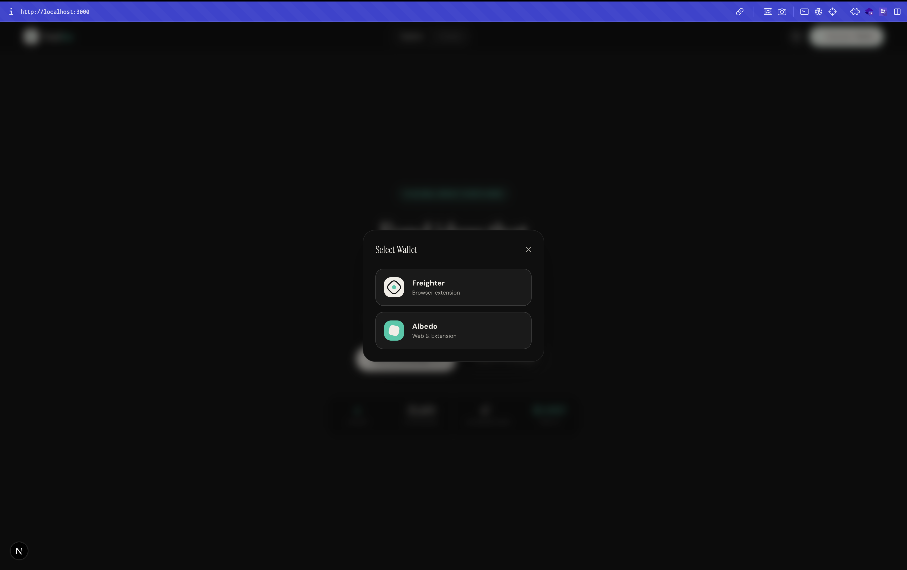
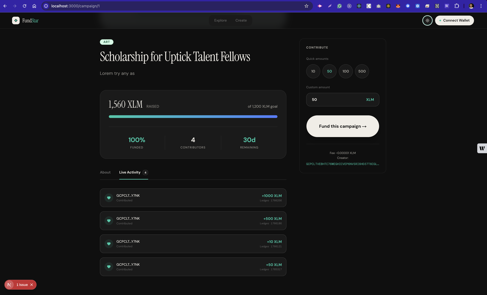
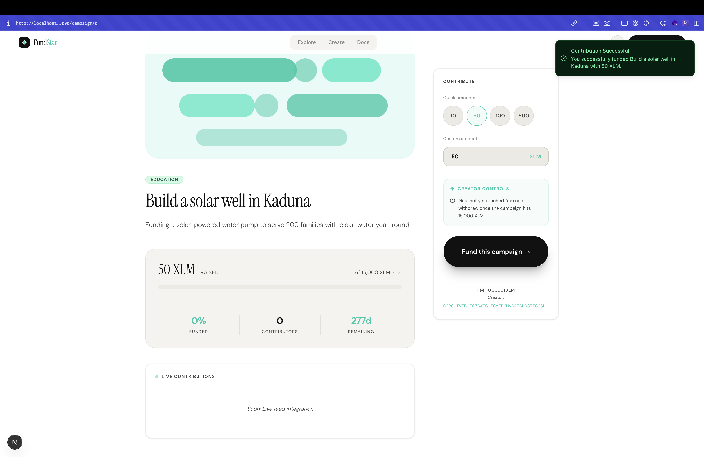
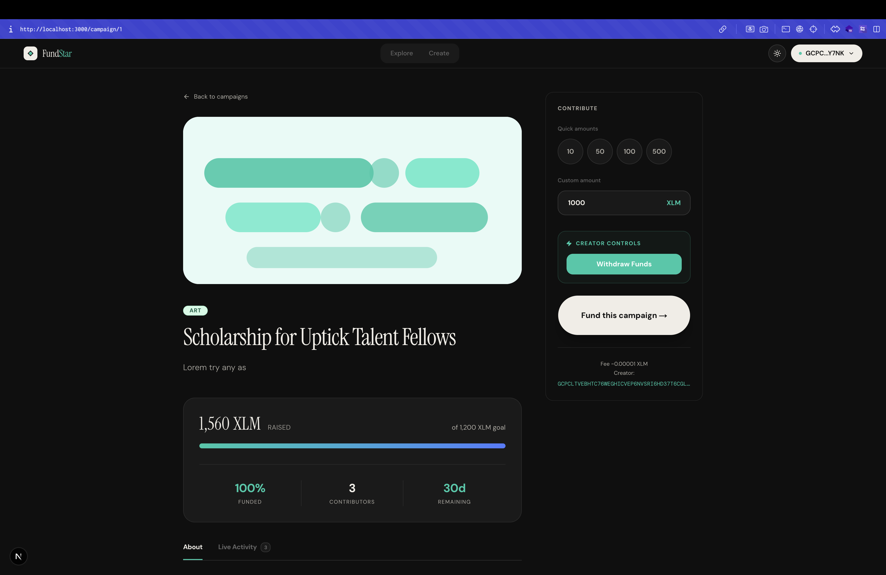
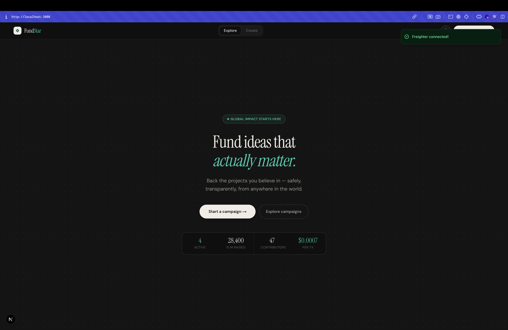
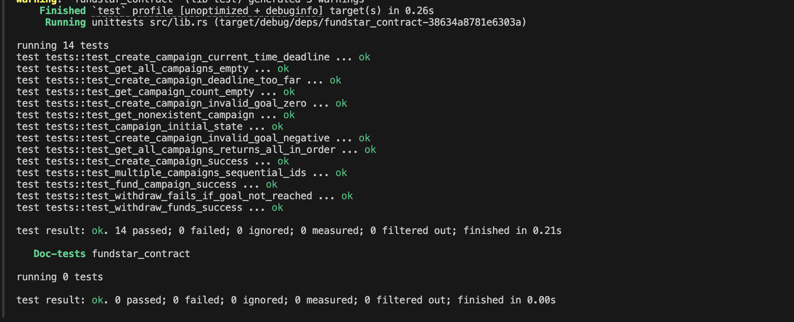

FundStar is a Soroban smart contract for creating and reading crowdfunding campaigns.

### 🌐 Live Deployment
**[fundstar.vercel.app](https://fundstar.vercel.app/)**

This repository includes helper scripts so users can run the project without manually typing long CLI commands.

## Prerequisites

1. Rust + Cargo installed
2. Stellar CLI installed (`stellar --version`)
3. Wasm target installed:

```bash
rustup target add wasm32v1-none
```

4. A Stellar testnet identity (example name: `fundstar`)

```bash
stellar keys generate fundstar
stellar keys fund fundstar --network testnet
```

## Project Scripts

### `scripts/contract.sh`

Used for test/build/deploy.

```bash
./scripts/contract.sh test
./scripts/contract.sh build
./scripts/contract.sh deploy
./scripts/contract.sh all
```

Defaults used by this script:

1. `NETWORK=testnet`
2. `SOURCE_ACCOUNT=fundstar`
3. `ALIAS=fundstar_contract`

Override them per command if needed:

```bash
NETWORK=testnet SOURCE_ACCOUNT=fundstar ALIAS=fundstar_contract ./scripts/contract.sh all
```

### `scripts/invoke.sh`

Used to invoke contract functions.

It expects:

1. `CONTRACT_ID` (required)
2. `NETWORK` (optional, default `testnet`)
3. `SOURCE_ACCOUNT` (optional, default `fundstar`)

The script auto-loads `.env` if present.

## Quick Start (Recommended)

1. Copy environment template:

```bash
cp .env.example .env
```

2. Open `.env` and set your deployed contract id:

```bash
CONTRACT_ID=CXXXXXXXXXXXXXXXXXXXXXXXXXXXXXXXXXXXXXXXXXXXXXXXXXXXXXXX
NETWORK=testnet
SOURCE_ACCOUNT=fundstar
```

3. Run full contract flow:

```bash
./scripts/contract.sh all
```

4. Invoke contract methods:

```bash
./scripts/invoke.sh get_campaign_count
./scripts/invoke.sh get_all_campaigns
./scripts/invoke.sh get_campaign --campaign_id 0
```

## Create Campaign Example

Set a future deadline (30 days from now) and create a campaign:

```bash
DEADLINE=$(( $(date +%s) + 2592000 ))

./scripts/invoke.sh create_campaign \
  --creator fundstar \
  --name "FundStar Demo Campaign" \
  --description "First campaign created via script" \
  --goal 1000000 \
  --deadline "$DEADLINE"
```

## Read Methods

Get number of campaigns:

```bash
./scripts/invoke.sh get_campaign_count
```

Get one campaign by id:

```bash
./scripts/invoke.sh get_campaign --campaign_id 0
```

Get all campaigns:

```bash
./scripts/invoke.sh get_all_campaigns
```

## Troubleshooting

### `Missing CONTRACT_ID`

1. Confirm `.env` exists in project root
2. Confirm `.env` contains a valid `CONTRACT_ID=C...`
3. Ensure no trailing characters in the id

Check quickly:

```bash
cat .env
```

### Wrong network or wrong contract id

Make sure deploy and invoke use the same network (`testnet`).

### Contract changed but behavior is old

You likely deployed an old Wasm artifact. Re-run:

```bash
./scripts/contract.sh all
```

## Level 2 Submission Details

This project fulfills all requirements for the FundStar Level 2 bounty.

### ✅ Submission Checklist
- [x] **3 error types handled**: `CampaignNotFound`, `GoalNotReached`, `InsufficientFunds` (Token-level).
- [x] **Contract deployed on testnet**: Live at `CAOAJBZA5JI5QSF3LY2QCVGHDIFQW5PQ7KBIE2JPUY6NBVWZYHDW4VCQ`.
- [x] **Contract called from the frontend**: Integrated using `stellar-sdk` and signature-based transactions.
- [x] **Transaction status visible**: Real-time toast notifications for preparation, signing, submission, and finalization.
- [x] **Minimum 2+ meaningful commits**: Multiple logical commits covering contract logic, frontend integration, and multi-wallet support.
- [x] **Multi-wallet support**: Integrated both **Freighter** and **Albedo** wallet providers.
- [x] **Real-time activity feed**: Implemented `getCampaignEvents` to stream contract events for live contribution updates.

### 📜 Contract Information
- **Contract ID**: `CAOAJBZA5JI5QSF3LY2QCVGHDIFQW5PQ7KBIE2JPUY6NBVWZYHDW4VCQ`
- **Deployment Hash**: [`87dca0cd31c52fff10a00e4f7e32bd493de6f231bd411bdb6edae744d61e3dee`](https://stellar.expert/explorer/testnet/tx/87dca0cd31c52fff10a00e4f7e32bd493de6f231bd411bdb6edae744d61e3dee)
- **Network**: Stellar Testnet
- **Native XLM SAC**: `CDLZFC3SYJYDZT7K67VZ75HPJVIEUVNIXF47ZG2FB2RMQQVU2HHGCYSC`
- **RPC Endpoint**: `https://soroban-testnet.stellar.org`

### 📸 UI Proof & Screenshots
Here are my screenshots for UI proofs, showcasing the completed features and on-chain integrations:

#### 1. Multi-Wallet Selector
Show the modal with Freighter and Albedo options.


#### 2. Live Activity Feed
Capture the "Activity" tab on a campaign page showing real on-chain contributions.


#### 3. Transaction Status
Demonstrate the real-time feedback (Toasts) during the funding process.


#### 4. Creator Dashboard
Show the withdrawal controls visible only to the campaign owner once the goal is reached.


#### 5. Wallet Connection
Proof of successful wallet connection (Freighter) and account authorization.


#### 6. Smart Contract Test Output
Verified results showing 14/14 automated tests passing in the Rust environment.


### 🚀 Key Features
- **Zero-Lag Caching**: In-memory caching for instantaneous navigation and zero-lag transition between pages.
- **High-Fidelity Skeletons**: Standardized skeleton loaders for a smooth, professional loading experience.
- **Dynamic Activity Feed**: Real-time updates for on-chain contributions using contract events.
- **Smart Wallet Routing**: Automatic detection and choice between Freighter and Albedo.
- **Creator Controls**: Role-based access for campaign creators to withdraw funds once goals are reached.

## 🟠 Level 3 - Orange Belt Submission

FundStar has been upgraded to meet the high standards of the Level 3 (Orange Belt) graduation.

### ✅ Level 3 Requirements
- [x] **Mini-dApp fully functional**: Deployed and tested on Stellar Testnet.
- [x] **Minimum 3 tests passing**: 14 comprehensive contract tests passing (see below).
- [x] **Loading states and progress indicators**: Implemented high-fidelity **Skeleton Loaders** for all data grids and detail views.
- [x] **Basic caching implementation**: Integrated a **Zero-Lag Caching Layer** in the frontend for instantaneous navigation.
- [x] **README complete**: All documentation, test results, and demo placeholders included.

### 🎥 Demo Video
[Watch the 1-minute demo video](https://www.loom.com/share/695d03e93cc743b8b52e1d4bb752740c)

### 🧪 Test Output (15 Passing)
FundStar uses a robust testing suite in Rust to ensure the safety of all crowdfunding operations.

```bash
running 15 tests
test tests::test_create_campaign_current_time_deadline ... ok
test tests::test_create_campaign_invalid_goal_zero ... ok
test tests::test_get_campaign_count_empty ... ok
test tests::test_create_campaign_deadline_too_far ... ok
test tests::test_create_campaign_invalid_goal_negative ... ok
test tests::test_get_all_campaigns_empty ... ok
test tests::test_get_nonexistent_campaign ... ok
test tests::test_create_campaign_success ... ok
test tests::test_campaign_initial_state ... ok
test tests::test_get_all_campaigns_returns_all_in_order ... ok
test tests::test_multiple_campaigns_sequential_ids ... ok
test tests::test_fund_campaign_success ... ok
test tests::test_withdraw_fails_if_goal_not_reached ... ok
test tests::test_withdraw_funds_success ... ok
test tests::test_reward_minting_on_funding ... ok

test result: ok. 15 passed; 0 failed; 0 ignored; 0 measured; 0 filtered out; finished in 0.12s
```

## 🟢 Level 4 - Green Belt Submission

FundStar has been upgraded with advanced inter-contract patterns and production-ready CI/CD infrastructure.

[](https://github.com/Kingscliq/fundstar/actions/workflows/ci.yml)

### ✅ Level 4 Requirements
- [x] **Inter-contract call working**: FundStar now mints STAR tokens via the Reward Token contract.
- [x] **Custom token deployed**: The `STAR` Loyalty Token (SAC interface) is live.
- [x] **CI/CD running**: GitHub Actions pipeline active for automated testing and builds.
- [x] **Mobile responsive**: UI fully optimized for mobile devices.
- [x] **Advanced event streaming**: Real-time contribution tracking via on-chain event indexing.

### ⛓️ Advanced Contract Details
- **Main Contract:** `CAOAJBZA5JI5QSF3LY2QCVGHDIFQW5PQ7KBIE2JPUY6NBVWZYHDW4VCQ`
- **Reward Token (STAR):** `ADD_TOKEN_ADDRESS_HERE`
- **Inter-Contract Minting TX:** `ADD_TX_HASH_HERE`

### 📱 Mobile UI Proof


### 🚀 Key Features (Level 4)
- **Loyalty Reward System**: Automated inter-contract minting of STAR tokens for every backer.
- **Automated QA**: Every push is verified by GitHub Actions (Rust tests + Next.js build).
- **Production Persistence**: Persistent session caching and optimized mobile layout.

## Security Notes

1. Commit scripts (`scripts/contract.sh`, `scripts/invoke.sh`)
2. Do not commit `.env` with secrets
3. Keep private keys and seed phrases out of repository files
